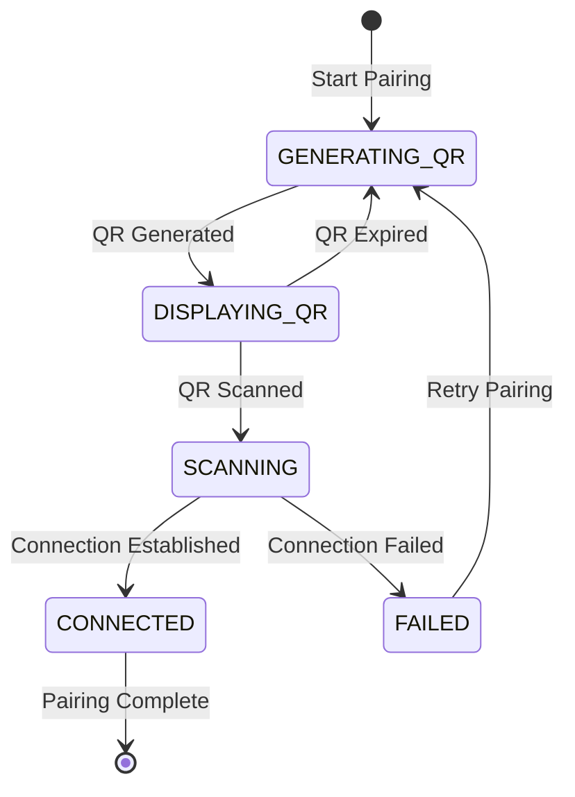

# Data Model: QR Code Display for WhatsApp Connection

**Feature**: 014-qr-code-display  
**Date**: 2025-04-15  
**Purpose**: Define data structures and entities for QR code functionality

## Core Entities

### QRCodeSession

Represents an active QR code pairing session.

```typescript
interface QRCodeSession {
  id: string;                    // Unique session identifier
  qrData: string;                // QR code data from Baileys
  expiresAt: Date;               // QR code expiration timestamp
  isActive: boolean;             // Whether this session is currently active
  createdAt: Date;               // Session creation timestamp
  refreshCount: number;          // Number of times QR has been refreshed
}
```

### QRDisplayState

Manages the current QR code display state and user interface.

```typescript
interface QRDisplayState {
  isDisplaying: boolean;         // Currently showing QR code
  currentSession?: QRCodeSession; // Active QR session
  lastInstruction: string;       // Last instruction shown to user
  warningMessage?: string;       // Optional warning (e.g., expiration warning)
}
```

### PairingStatus

Tracks the overall WhatsApp pairing process status.

```typescript
enum PairingStatus {
  IDLE = 'idle',                 // No pairing in progress
  GENERATING_QR = 'generating',  // Generating QR code
  DISPLAYING_QR = 'displaying',  // QR code displayed, waiting for scan
  SCANNING = 'scanning',         // QR code scanned, establishing connection
  CONNECTED = 'connected',       // Successfully connected
  FAILED = 'failed'              // Pairing failed
}
```

## Extended Types (Existing)

### WhatsAppConnectionStatus (Extension)

Extends existing connection status to include QR-specific states.

```typescript
// Extension of existing SessionStatus type
type ExtendedSessionStatus = SessionStatus | 'pairing' | 'qr-expired';
```

### QRCodeDisplayOptions

Configuration options for QR code display.

```typescript
interface QRCodeDisplayOptions {
  terminalWidth?: number;        // Terminal width for QR sizing
  refreshInterval: number;       // QR refresh interval in milliseconds
  showInstructions: boolean;     // Whether to show pairing instructions
  showExpirationWarning: boolean; // Show warning before QR expires
}
```

## State Transitions

### QR Code Lifecycle



### Data Flow

1. **QR Generation**: Baileys provides QR string → QRCodeSession created
2. **Display**: QRCodeSession → QRDisplayState → Terminal output
3. **Refresh**: Timer expires → New QRCodeSession → Update display
4. **Connection**: User scans → State transitions → Credentials saved

## Validation Rules

### QRCodeSession Validation

- `qrData`: Must be non-empty string from Baileys
- `expiresAt`: Must be future timestamp (typically 60 seconds from creation)
- `refreshCount`: Must be non-negative integer
- `isActive`: Must be boolean, only one session can be active at a time

### QRDisplayState Validation

- `isDisplaying`: Must match presence of `currentSession`
- `lastInstruction`: Must be non-empty when displaying
- `warningMessage`: Optional, must be non-empty if present

## Storage Requirements

### In-Memory State

- QRCodeSession: Temporary, exists only during pairing
- QRDisplayState: Temporary, UI state management
- PairingStatus: Temporary, connection state tracking

### Persistent State

- No additional persistent storage required
- Uses existing WhatsApp auth state persistence
- QR sessions are ephemeral by design

## Integration Points

### With WhatsApp Service

```typescript
// Extension to existing WhatsAppService
class WhatsAppService {
  private qrDisplayState?: QRDisplayState;
  private currentQRSession?: QRCodeSession;
  private pairingStatus: PairingStatus = PairingStatus.IDLE;
  
  // New methods for QR functionality
  private handleQRCode(qrData: string): void;
  private refreshQRCode(): void;
  private displayQRInstructions(): void;
}
```

### With Session Manager

```typescript
// Extension to existing SessionManager
class SessionManager {
  // New method to check if QR flow is needed
  public needsQRCode(): Promise<boolean>;
  
  // New method to handle QR completion
  public markQRCompleted(): Promise<void>;
}
```

## Error Handling Data Structures

### QRError

```typescript
interface QRError {
  code: string;                  // Error code (e.g., 'TERMINAL_UNSUPPORTED')
  message: string;               // User-friendly error message
  technical?: string;            // Technical details for debugging
  recoverable: boolean;          // Whether user can retry
}
```

### Error Types

- `TERMINAL_UNSUPPORTED`: Terminal doesn't support UTF-8
- `QR_GENERATION_FAILED`: Baileys failed to generate QR
- `DISPLAY_ERROR`: Failed to render QR in terminal
- `CONNECTION_TIMEOUT`: QR expired without scanning
- `NETWORK_ERROR`: Network connectivity issues
